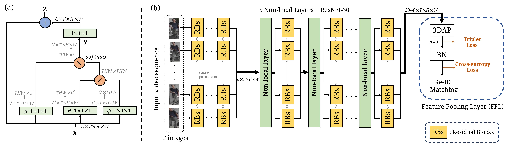
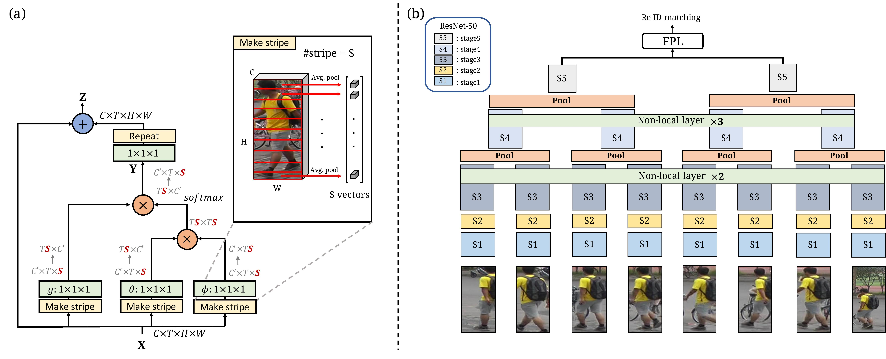

# Spatially and Temporally Efficient Non-local Attention Network for Video-based Person Re-Identification
- **NVAN**
<p align="center"></p>

- **STE-NVAN**
<p align="center"></p>

[[Paper]](http://media.ee.ntu.edu.tw/research/STE_NVAN/BMVC19_STE_NVAN_cam.pdf) [[arXiv]](https://arxiv.org/abs/1908.01683)

Chih-Ting Liu, Chih-Wei Wu, [Yu-Chiang Frank Wang](http://vllab.ee.ntu.edu.tw/members.html) and [Shao-Yi Chien](http://www.ee.ntu.edu.tw/profile?id=101),<br/>British Machine Vision Conference (**BMVC**), 2019

This is the pytorch implementatin of Spatially and Temporally Efficient Non-local Video Attention Network **(STE-NVAN)** for video-based person Re-ID. 
<br/>It achieves **90.0%** for the baseline version and **88.9%** for the ST-efficient model in rank-1 accuracy on MARS dataset.

## Prerequisites
- Python3.5+
- [Pytorch](https://pytorch.org/) (We run the code under version 1.0.)
- torchvisoin (We run the code under version 0.2.2)

## Getting Started

### Installation
- Install dependancy. You can install all the dependancies by:
```
$ pip3 install numpy, Pillow, progressbar2, tqdm, pandas 
```

### Datasets
We conduct experiments on [MARS](http://www.liangzheng.com.cn/Project/project_mars.html) and [DukeMTMC-VideoReID](https://github.com/Yu-Wu/DukeMTMC-VideoReID) (DukeV) datasets.

**For MARS dataset:**
- Download and unzip the dataset from the official website. ([Google Drive](https://drive.google.com/drive/u/1/folders/0B6tjyrV1YrHeMVV2UFFXQld6X1E))
- Clone the repo of [MARS-evaluation](https://github.com/liangzheng06/MARS-evaluation). We will need the files under **info/** directory.
<br/>You will have the structure as follows:
```
path/to/your/MARS dataset/
|-- bbox_train/
|-- bbox_test/
|-- MARS-evaluation/
|   |-- info/
```
- run `create_MARS_database.py` to create the database files (.txt and .npy files) into "MARS_database" directory.
```
$ python3 create_MARS_database.py --data_dir /path/to/MARS dataset/ \
                                --info_dir /path/to/MARS dataset/MARS-evaluation/info/ \
                                --output_dir ./MARS_database/
```

**For DukeV dataset:**
- Download and unzip the dataset from the official github page. ([data link](http://vision.cs.duke.edu/DukeMTMC/data/misc/DukeMTMC-VideoReID.zip))
<br/>You will have the structure as follows:
```
path/to/your/DukeV dataset/
|-- gallery/
|-- query/
|-- train/
```
- run `create_DukeV_database.py` to create the database files (.txt and .npy files) into "DukeV_database" directory.
```
$ python3 create_DukeV_database.py --data_dir /path/to/DukeV dataset/ \
                                 --output_dir ./DukeV_database/
```
## Usage-Testing
We rewrite the evaluation code in [here](https://github.com/liangzheng06/MARS-evaluation) with python.

Furthermore, we follow the video-based evaluation metric in this [paper](https://zpascal.net/cvpr2018/Li_Diversity_Regularized_Spatiotemporal_CVPR_2018_paper.pdf).

In detail, we will sample the first frame in each chunk of a tracklet.

### Prerequisite
For testing, we provide three trained models on **MARS** dataset in this [**link**](https://drive.google.com/drive/folders/1yi4RJHhu8iMtewdnWYpLCLkIi0okjl35?usp=sharing).

You should first create a directory with this command: `$ mkdir ckpt`, to put these three models under the directory.

All three execution commands are in the script `run_evaluate.sh`. 
You can check and alter the arguments inside and run 
```
$ sh run_evaluate.sh
``` 
to obtain the rank-1 accuracy and the mAP score. 

Some scores are different to those in my paper because some models are lost in my previous computer. (I've retrained them again.) 

The evaluation commands of three models are as follows.

### Baseine model : Resnet50 + FPL (mean)
Uncomment this part. You will get R1=87.42% and mAP=79.44%.
```
# Evaluate ResNet50 + FPL (mean or max)
LOAD_CKPT=./ckpt/R50_baseline_mean.pth
python3 evaluate.py --test_txt $TEST_TXT --test_info $TEST_INFO --query_info $QUERY_INFO \
                    --batch_size 64 --model_type 'resnet50_s1' --num_workers 8  --S 8 \
                    --latent_dim 2048 --temporal mean --stride 1 --load_ckpt $LOAD_CKPT 
```
### NVAN : R50 + 5 Non-local layers + FPL
Uncomment this part. You will get R1=90.00% and mAP=82.79%.
```
#Evaluate NVAN (R50 + 5 NL + FPL)
LOAD_CKPT=./ckpt/NVAN.pth
python3 evaluate.py --test_txt $TEST_TXT  --test_info  $TEST_INFO   --query_info $QUERY_INFO \
                    --batch_size 64 --model_type 'resnet50_NL' --num_workers 8  --S 8 --latent_dim 2048 \
                    --temporal Done  --non_layers  0 2 3 0 --load_ckpt $LOAD_CKPT \
```
### STE-NVAN : NVAN + Spatial Reduction + Temporal Reduction
Uncomment this part. You will get R1=88.69% and mAP=81.27%.
```
# Evaluate NVAN (R50 + 5 NL + Stripe + Hierarchical + FPL)
LOAD_CKPT=./ckpt/STE_NVAN.pth
python3 evaluate.py --test_txt $TEST_TXT  --test_info  $TEST_INFO   --query_info $QUERY_INFO \
                    --batch_size 128 --model_type 'resnet50_NL_stripe_hr' --num_workers 8  --S 8 --latent_dim 2048 \
                    --temporal Done  --non_layers  0 2 3 0 --stripe 16 16 16 16 --load_ckpt $LOAD_CKPT \
```

## Usage-Training
As mentioned in our paper, we have three kinds of models. (Baseline, NVAN, STE-NVAN)

### Baseine model : Resnet50 + FPL (mean)
You can alter the arguments in `run_baseline.sh` or just use this command:
```
$ sh run_baseline.sh
```
### NVAN : R50 + 5 Non-local layers + FPL
You can alter the arguments or uncomment this part in `run_NL.sh`:
```
# For NVAN
CKPT=ckpt_NL_0230
python3 train_NL.py --train_txt $TRAIN_TXT --train_info $TRAIN_INFO  --batch_size 64 \
                     --test_txt $TEST_TXT  --test_info  $TEST_INFO   --query_info $QUERY_INFO \
                     --n_epochs 200 --lr 0.0001 --lr_step_size 50 --optimizer adam --ckpt $CKPT --log_path loss.txt --class_per_batch 8 \
                     --model_type 'resnet50_NL' --num_workers 8 --track_per_class 4 --S 8 --latent_dim 2048 --temporal Done  --track_id_loss \
                     --non_layers  0 2 3 0
```
Then run this script.
```
$ sh run_NL.sh
```
### STE-NVAN : NVAN + Spatial Reduction + Temporal Reduction
You can alter the arguments or uncomment this part in `run_NL.sh`:
```
# For STE-NVAN
CKPT=ckpt_NL_stripe16_hr_0230
python3 train_NL.py --train_txt $TRAIN_TXT --train_info $TRAIN_INFO  --batch_size 64 \
                    --test_txt $TEST_TXT  --test_info  $TEST_INFO   --query_info $QUERY_INFO \
                    --n_epochs 200 --lr 0.0001 --lr_step_size 50 --optimizer adam --ckpt $CKPT --log_path loss.txt --class_per_batch 8 \
                    --model_type 'resnet50_NL_stripe_hr' --num_workers 8 --track_per_class 4 --S 8 --latent_dim 2048 --temporal Done  --track_id_loss \
                    --non_layers  0 2 3 0 --stripes 16 16 16 16 
```
Then run this script.
```
$ sh run_NL.sh
```

## Citation

## Reference

Chih-Ting Liu, [Media IC & System Lab](https://github.com/mediaic), National Taiwan University

E-mail : jackieliu@media.ee.ntu.edu.tw
